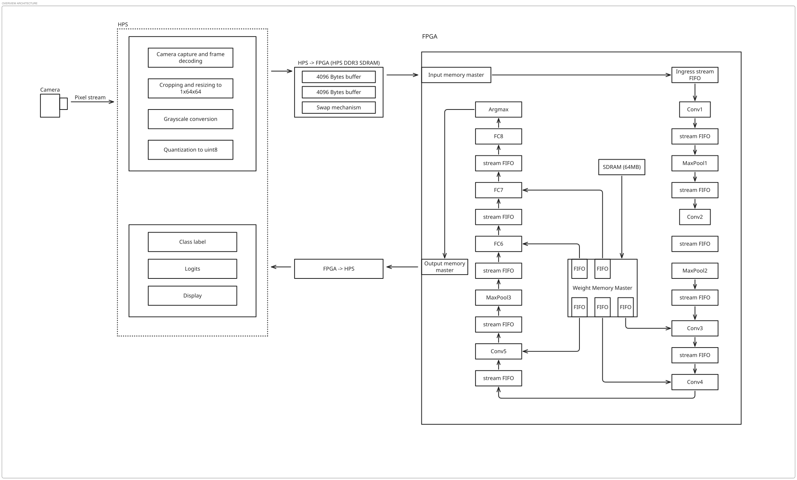

# Hardware — FPGA Inference Pipeline

This directory contains the RTL implementation of an integer-only CNN inference
pipeline targeting the **Intel Cyclone V SE SoC** on the Terasic DE1-SoC board.

The pipeline targets **AlexNet64Gray**, a compact convolutional network trained and
quantized in the `ml/` directory.

All inference arithmetic is integer-only:

```text
uint8 activations
int8 weights
int32 accumulators
per-channel fixed-point requantization
```

No floating-point datapath is required.

---

## Current implementation status

The current completed hardware milestone is:

```text
hardware/rtl/layers/conv_layer.vhd
```

The generic convolution layer currently supports:

- unsigned 8-bit activation input;
- signed 8-bit convolution weights;
- signed 32-bit accumulation;
- signed 32-bit per-channel bias;
- ReLU;
- unsigned 32-bit per-channel requantization multipliers;
- unsigned 8-bit per-channel right shifts;
- round-half-up requantization;
- unsigned 8-bit saturation;
- configurable input and output channels;
- configurable kernel size;
- configurable padding;
- configurable stride;
- parallel output-channel lanes;
- multiple input channels;
- multiple output-channel groups;
- output backpressure;
- stable raw and quantized outputs while stalled;
- frame-completion signaling;
- automatic restart for the next frame.

The convolution implementation is bit-exact in simulation against all five exported
convolution layers of AlexNet64Gray.

Current real-vector result:

```text
Convolution real-vector results
  Ran:    5 layers
  Passed: 5 layers
  Failed: 0 layers
```

The following blocks remain future implementation work:

```text
maxpool_layer
fc_layer
external-memory controller
pipeline controller
top-level pipeline integration
argmax/output stage
Quartus synthesis and timing validation
```

---

## Planning-analysis notice

Steps 1 through 4 contain the original pre-implementation analysis.

These sections document:

- the device resource budget;
- network operation counts;
- weight-memory requirements;
- proposed DSP allocation;
- proposed BRAM and SDRAM placement;
- theoretical throughput estimates.

They are useful architectural planning references, but they are **not Quartus
implementation results**.

The completed `conv_layer` differs from some early assumptions, especially in:

- line-buffer organization;
- output-channel parallelism;
- active weight-buffer size;
- weight streaming;
- MAC scheduling;
- output width;
- frame handling;
- module decomposition.

Actual ALM, register, M10K, MLAB, DSP, timing, and Fmax values must come from Quartus
synthesis and place-and-route reports.

---

## Table of contents

- [Step 1 — Hardware baseline](#step-1--hardware-baseline)
- [Step 2 — Network compute and weight requirements](#step-2--network-compute-and-weight-requirements)
- [Step 3 — Original throughput analysis](#step-3--original-throughput-analysis)
- [Step 4 — Memory architecture](#step-4--memory-architecture)
- [Step 5 — Current RTL architecture](#step-5--current-rtl-architecture)
- [Step 6 — Verification status](#step-6--verification-status)
- [Step 7 — Remaining implementation plan](#step-7--remaining-implementation-plan)

---

# Step 1 — Hardware baseline

## 1.1 Target device

**Target device:** Intel Cyclone V SE SoC — `5CSEMA5F31C6N`

The base silicon designation used in Intel's product table is **5CSEA5**.

Reference:

[Altera Cyclone V SE FPGA 5CSEA5 F31](https://www.altera.com/products/fpga/cyclone/v/se/5csea5-f31/5CSEMA5F31C6N)

| Field | Value | Meaning |
|---|---:|---|
| `5C` | Cyclone V | Device family |
| `SE` | SE variant | SoC with dual-core ARM Cortex-A9 HPS |
| `A5` | Density code | 85K marketed LEs |
| `F31` | Package | 896-pin FBGA |
| `C6` | Speed grade | Commercial, speed grade 6 |
| `N` | Packaging | Lead-free / RoHS |

---

## 1.2 Resource table

Figures below come from the Cyclone V product table for the 5CSEA5 device.

Reference:

[Cyclone V FPGA and SoC FPGA Product Table](https://cdrdv2-public.intel.com/714207/cyclone-v-product-table.pdf)

| Resource | Count | Notes |
|---|---:|---|
| Logic elements | 85K | Marketing figure |
| Adaptive logic modules | **32,070** | Main synthesis unit |
| Registers | **128,300** | Flip-flops inside ALMs |
| M10K blocks | **397** | 10 Kbit memory blocks |
| Total M10K memory | **3,970 Kbit** | Approximately 496 KB |
| MLAB memory | 480 Kbit | LUT-based distributed memory |
| Variable-precision DSP blocks | **87** | Physical DSP blocks |
| 18×18 multipliers | 174 | Two per DSP block |
| FPGA PLLs | 6 | |
| HPS DDR3 | 1 GB | Through HPS memory controller |
| FPGA-connected SDRAM | 64 MB | IS42S16320F, 16-bit bus |

The 85K logic-element figure is a marketing aggregate.

Resource reports should be interpreted using:

```text
ALMs
registers
M10K blocks
DSP blocks
```

---

## 1.3 DSP block modes

Each Cyclone V variable-precision DSP block can operate in several multiplier modes.

| Mode | Multiplier size | Multiplications per DSP block |
|---|---:|---:|
| 9×9 SIMD | 9-bit × 9-bit | 3 |
| 18×18 | 18-bit × 18-bit | 2 |
| 27×27 | 27-bit × 27-bit | 1 |

The 9×9 mode is relevant to this design because:

```text
uint8 activation requires 9 signed bits after zero extension
int8 weight requires 8 signed bits
```

The theoretical maximum number of simultaneous 9×9 multiplications is:

```text
87 DSP blocks × 3 multipliers = 261 multiplications
```

A planning budget of approximately 80–85% was used in the original analysis:

```text
approximately 220 parallel multiplications
```

This is only a planning target.

Whether the implemented multipliers map to the expected DSP mode must be checked in
Quartus.

---

## 1.4 On-chip memory budget

Each M10K block stores:

```text
10 Kbit = 1,280 bytes
```

With 397 blocks:

```text
397 × 1,280 bytes ≈ 496 KB
```

This is not sufficient to store the complete model weight set, so external-memory
weight storage is required for the larger layers.

---

# Step 2 — Network compute and weight requirements

The network is:

```text
AlexNet64Gray
```

Source:

```text
ml/src/models/alexnet64gray.py
```

Input:

```text
1 × 64 × 64 grayscale image
```

Output:

```text
10 classes
```

---

## 2.1 Layer dimensions

| Layer | Input shape | Output shape | Kernel | Stride | Padding |
|---|---|---|---:|---:|---:|
| Conv1 | 1×64×64 | 64×64×64 | 5×5 | 1 | 2 |
| MaxPool1 | 64×64×64 | 64×32×32 | 2×2 | 2 | 0 |
| Conv2 | 64×32×32 | 192×32×32 | 3×3 | 1 | 1 |
| MaxPool2 | 192×32×32 | 192×16×16 | 2×2 | 2 | 0 |
| Conv3 | 192×16×16 | 384×16×16 | 3×3 | 1 | 1 |
| Conv4 | 384×16×16 | 256×16×16 | 3×3 | 1 | 1 |
| Conv5 | 256×16×16 | 256×16×16 | 3×3 | 1 | 1 |
| MaxPool3 | 256×16×16 | 256×8×8 | 2×2 | 2 | 0 |
| FC6 | 16,384 | 1,024 | — | — | — |
| FC7 | 1,024 | 1,024 | — | — | — |
| FC8 | 1,024 | 10 | — | — | — |

---

## 2.2 MACs per image

For convolution:

```text
MACs =
    C_OUT × H_OUT × W_OUT × C_IN × K_H × K_W
```

For fully connected layers:

```text
MACs =
    C_OUT × C_IN
```

| Layer | Calculation | MACs |
|---|---|---:|
| Conv1 | 64 × 64×64 × 1×5×5 | 6.6M |
| Conv2 | 192 × 32×32 × 64×3×3 | 113M |
| Conv3 | 384 × 16×16 × 192×3×3 | 170M |
| Conv4 | 256 × 16×16 × 384×3×3 | 226M |
| Conv5 | 256 × 16×16 × 256×3×3 | 151M |
| FC6 | 1,024 × 16,384 | 16.8M |
| FC7 | 1,024 × 1,024 | 1.0M |
| FC8 | 10 × 1,024 | <0.1M |
| **Total** | | **Approximately 684M** |

Conv3, Conv4, and Conv5 account for most of the compute.

---

## 2.3 Weight storage

For int8 weights:

```text
weight_bytes =
    C_OUT × C_IN × K_H × K_W
```

For int32 biases:

```text
bias_bytes =
    C_OUT × 4
```

| Layer | Weights | Biases | Approximate total |
|---|---:|---:|---:|
| Conv1 | 1,600 B | 256 B | 1.8 KB |
| Conv2 | 110,592 B | 768 B | 108.7 KB |
| Conv3 | 663,552 B | 1,536 B | 649.5 KB |
| Conv4 | 884,736 B | 1,024 B | 865 KB |
| Conv5 | 589,824 B | 1,024 B | 577 KB |
| FC6 | 16,777,216 B | 4,096 B | 16 MB |
| FC7 | 1,048,576 B | 4,096 B | 1 MB |
| FC8 | 10,240 B | 40 B | 10 KB |
| **Total** | | | **Approximately 19.2 MB** |

The complete network is much larger than the available M10K memory.

---

## 2.4 Original proposed weight placement

The original architecture proposed the following system-level placement:

| Layer | Proposed storage |
|---|---|
| Conv1 | On-chip memory |
| Conv2 | On-chip memory |
| Conv3 | External SDRAM |
| Conv4 | External SDRAM |
| Conv5 | External SDRAM |
| FC6 | External SDRAM |
| FC7 | External SDRAM |
| FC8 | On-chip memory |

This remains a useful system-level proposal.

It does **not** describe the current internal storage of `conv_layer`.

The implemented convolution layer contains only an active working weight slice.
The full layer weight tensor must be managed by an external provider.

---

## 2.5 MACs per output channel and position

```text
MACs per output channel and spatial position =
    C_IN × K_H × K_W
```

| Layer | MACs per output channel and position |
|---|---:|
| Conv1 | 25 |
| Conv2 | 576 |
| Conv3 | 1,728 |
| Conv4 | 3,456 |
| Conv5 | 2,304 |

Conv4 has the largest accumulation depth.

---

# Step 3 — Original throughput analysis

This section preserves the original throughput-planning model.

The values below are not measured from the current RTL.

---

## 3.1 Original spatial-pipeline assumption

The original system proposal instantiated all major layers concurrently as a spatial
pipeline.

With total compute work `M_TOTAL` and a parallel multiplication budget `D`, the ideal
balanced latency was approximated as:

```text
cycles_per_image ≈ M_TOTAL / D
```

A proportional allocation was estimated using:

```text
P_i =
    layer_MACs_i × D / total_MACs
```

---

## 3.2 Original DSP allocation estimate

Using a planning budget of approximately 220 parallel multiplications:

| Layer | Total MACs | Original allocation estimate |
|---|---:|---:|
| Conv1 | 6.6M | 2 |
| Conv2 | 113M | 36 |
| Conv3 | 170M | 55 |
| Conv4 | 226M | 73 |
| Conv5 | 151M | 48 |
| FC6 | 16.8M | 5 |
| FC7 and FC8 | Approximately 1M | Shared |
| **Total** | Approximately 685M | **219** |

This estimate assumed a different degree of internal parallelism than the current
`conv_layer`.

The implemented generic:

```text
G_C_PAR
```

specifies the number of output channels calculated in parallel.

It is not a direct statement of how many independent complete MAC operations occur
per clock.

---

## 3.3 Original memory-bandwidth estimate

The original analysis assumed approximately 150 MB/s from the FPGA-connected SDRAM.

| Data | Size | Ideal transfer time at 150 MB/s |
|---|---:|---:|
| Conv3 weights | 649.5 KB | 4.3 ms |
| Conv4 weights | 865 KB | 5.8 ms |
| Conv5 weights | 577 KB | 3.8 ms |
| FC6 weights | 16 MB | 106.7 ms |
| FC7 weights | 1 MB | 6.7 ms |

The original estimated throughput was:

```text
approximately 7 frames per second for an all-FPGA v1
approximately 30 frames per second after removing the FC bandwidth bottleneck
```

These numbers remain planning estimates only.

Actual throughput depends on:

- synthesized clock frequency;
- DSP inference;
- memory-controller efficiency;
- burst length;
- FIFO depth;
- weight reuse;
- backpressure;
- layer scheduling;
- top-level pipeline architecture.

---

## 3.4 Possible future optimizations

| Optimization | Intended benefit |
|---|---|
| HPS offload of fully connected layers | Remove FPGA FC bandwidth bottleneck |
| HPS DDR3 weight streaming | Higher weight bandwidth |
| Global average pooling | Remove FC6 and FC7 |
| Weight double buffering | Hide some memory latency |
| Larger output-channel parallelism | Reduce group count |
| Weight prefetching | Reduce MAC stalls |
| Layer-specific scheduling | Better resource sharing |

---

# Step 4 — Memory architecture

## 4.1 Current convolution line-buffer organization

The implemented `conv_layer` uses:

```text
G_KERNEL active physical row buffers
one spare physical row buffer
```

The physical line-buffer array therefore contains:

```text
G_KERNEL + 1 rows
```

Each row stores:

```text
G_W_IN × G_C_IN bytes
```

The logical storage size is:

```text
line_buffer_bytes =
    (G_KERNEL + 1) × G_W_IN × G_C_IN
```

The exact M10K or MLAB usage depends on Quartus packing and inference.

---

## 4.2 Logical row mapping

The convolution window does not copy complete rows during vertical movement.

Instead, the RTL maintains:

```text
row_map
row_valid
spare_row
```

For a three-row logical window:

```text
before rotation:
    logical row 0 → physical row A
    logical row 1 → physical row B
    logical row 2 → physical row C
    spare row     → physical row D

after rotation:
    logical row 0 → physical row B
    logical row 1 → physical row C
    logical row 2 → physical row D
    spare row     → physical row A
```

Only row roles change.

Physical activation contents are not copied.

---

## 4.3 Padding representation

Top and bottom padding rows are represented with:

```text
row_valid = 0
```

Left and right padding positions are detected by the calculated input-column index.

Padded activation values are generated internally as zero.

No padding bytes are consumed from the activation stream.

---

## 4.4 Current active weight buffer

The implemented convolution layer does not hold the complete layer weight tensor.

It contains one active slice:

```text
G_C_PAR × G_KERNEL × G_KERNEL signed int8 weights
```

This slice corresponds to:

```text
G_C_PAR output channels
for one input-channel contribution
```

The full model weight tensor remains external to the layer.

The weight source may eventually be implemented using:

- on-chip ROM or RAM;
- an M10K-backed cache;
- a FIFO;
- external SDRAM;
- HPS DDR3;
- DMA or Avalon-MM infrastructure.

The storage mechanism is external to `conv_layer`.

---

## 4.5 Bias and requantization storage

The current layer stores the following values for every output channel:

```text
signed int32 bias
unsigned uint32 requantization multiplier
unsigned uint8 requantization shift
```

Logical storage requirement:

```text
G_C_OUT × (4 + 4 + 1) bytes
```

These values are loaded through the configuration-write interface and remain stored
across frame restarts.

---

## 4.6 Accumulator storage

The RTL contains:

```text
G_C_PAR signed 32-bit accumulators
```

It also contains:

```text
G_C_PAR signed 32-bit raw result registers
G_C_PAR unsigned 8-bit quantized result registers
```

These holding registers keep both outputs stable during backpressure.

---

## 4.7 Sequential kernel traversal

The current implementation does not materialize the complete:

```text
K × K × C_IN
```

activation window as one large fully parallel register array.

Instead, it walks through:

```text
kernel position
input channel
```

over multiple cycles while calculating:

```text
G_C_PAR output lanes in parallel
```

This significantly changes the register and DSP estimates from the original
pre-implementation architecture.

---

## 4.8 Resource-report policy

The following earlier estimates should not be presented as implementation results:

```text
163 M10K blocks
71,720 flip-flops
219 allocated DSP lanes
30 fps convolution pipeline
7 fps complete pipeline
```

They remain planning estimates.

The authoritative implementation values must come from:

```text
Quartus Analysis and Synthesis
Quartus Fitter
TimeQuest Timing Analyzer
DSP utilization reports
RAM inference reports
```

---

# Step 5 — Current RTL architecture

## 5.1 Current file organization

Current implemented convolution files include:

```text
hardware/rtl/layers/conv_layer.vhd

verification/tb/conv/
verification/tb/layers/

verification/sim/run_conv.sh
verification/sim/run_conv_traversal.sh
verification/sim/run_layers.sh
```

The current convolution layer is implemented as one RTL architecture containing
multiple concurrent worker processes.

It is not currently decomposed into separate:

```text
line_buffer.vhd
mac_array.vhd
requant_unit.vhd
weight_bram.vhd
```

entities.

Those components may be extracted later as a refactoring, but the verified
implementation is presently contained inside `conv_layer.vhd`.

---

## 5.2 Current `conv_layer` generics

```vhdl
generic (
    G_C_IN    : positive;
    G_C_OUT   : positive;
    G_W_IN    : positive;
    G_H_IN    : positive;
    G_C_PAR   : positive;
    G_KERNEL  : positive;
    G_PADDING : natural;
    G_STRIDE  : positive
);
```

### Generic meanings

| Generic | Meaning |
|---|---|
| `G_C_IN` | Number of input channels |
| `G_C_OUT` | Number of output channels |
| `G_W_IN` | Input tensor width |
| `G_H_IN` | Input tensor height |
| `G_C_PAR` | Output channels calculated in parallel |
| `G_KERNEL` | Square convolution-kernel size |
| `G_PADDING` | Symmetric zero padding |
| `G_STRIDE` | Equal horizontal and vertical stride |

The current implementation requires:

```text
G_C_OUT mod G_C_PAR = 0
```

---

## 5.3 Current entity interface

```vhdl
port (
    clk   : in std_logic;
    rst_n : in std_logic;

    i_valid : in  std_logic;
    i_ready : out std_logic;
    i_data  : in  std_logic_vector(7 downto 0);

    i_weight_valid : in  std_logic;
    o_weight_ready : out std_logic;
    i_weight_data  : in  std_logic_vector(7 downto 0);

    cfg_we    : in std_logic;
    cfg_sel   : in std_logic_vector(1 downto 0);
    cfg_addr  : in std_logic_vector(19 downto 0);
    cfg_wdata : in std_logic_vector(31 downto 0);

    o_valid : out std_logic;
    o_data  : out std_logic_vector(G_C_PAR * 8 - 1 downto 0);

    o_done : out std_logic;

    i_acc_ready : in  std_logic;
    o_acc_valid : out std_logic;
    o_acc_data  : out std_logic_vector(G_C_PAR * 32 - 1 downto 0)
);
```

The reset is synchronous and active low.

---

## 5.4 Activation input protocol

```vhdl
i_valid : in  std_logic;
i_ready : out std_logic;
i_data  : in  std_logic_vector(7 downto 0);
```

A transfer occurs when:

```text
i_valid = 1
and
i_ready = 1
```

Activations are unsigned 8-bit values.

Input order is:

```text
input row
    → input column
        → input channel
```

No padding bytes are supplied by the source.

The layer generates zero padding internally.

---

## 5.5 Weight input protocol

```vhdl
i_weight_valid : in  std_logic;
o_weight_ready : out std_logic;
i_weight_data  : in  std_logic_vector(7 downto 0);
```

A transfer occurs when:

```text
i_weight_valid = 1
and
o_weight_ready = 1
```

Weights are interpreted as signed 8-bit values.

One complete accepted batch contains:

```text
G_C_PAR × G_KERNEL × G_KERNEL bytes
```

Batch order is lane-major:

```text
lane 0:
    kernel row 0
    kernel row 1
    ...

lane 1:
    kernel row 0
    kernel row 1
    ...

...

lane G_C_PAR - 1
```

Kernel values within each lane are row-major.

The external provider must respond to the requests generated by the layer.

Current request patterns are:

### Single input channel and one output group

```text
one initial weight batch
reused across the complete frame
```

### Single input channel and multiple output groups

```text
output row
    → output group
```

### Multiple input channels

```text
output row
    → output group
        → output column
            → input channel
```

The testbench weight driver follows the actual `o_weight_ready` handshake rather
than assuming fixed timing.

---

## 5.6 Parameter configuration interface

```vhdl
cfg_we    : in std_logic;
cfg_sel   : in std_logic_vector(1 downto 0);
cfg_addr  : in std_logic_vector(19 downto 0);
cfg_wdata : in std_logic_vector(31 downto 0);
```

`cfg_addr` is the absolute output-channel index.

Selections:

```text
cfg_sel = "01" → signed int32 bias
cfg_sel = "10" → unsigned uint32 requantization multiplier
cfg_sel = "11" → unsigned uint8 requantization right shift
cfg_sel = "00" → reserved
```

Bias and multiplier use all 32 bits.

Right shift uses:

```vhdl
cfg_wdata(7 downto 0)
```

Parameter writes outside the implemented output-channel range are ignored.

Parameters must be configured before frame processing begins.

They remain loaded across automatic frame restarts.

---

## 5.7 Quantized output protocol

```vhdl
o_valid : out std_logic;
o_data  : out std_logic_vector(G_C_PAR * 8 - 1 downto 0);
```

Each transfer contains:

```text
G_C_PAR output-channel activations
```

Lane `n` occupies:

```vhdl
o_data((n + 1) * 8 - 1 downto n * 8)
```

Output stream order is:

```text
output row
    → output group
        → output column
            → lane
```

Absolute output channel:

```text
output_channel =
    output_group × G_C_PAR + lane
```

The current quantized output does not have a separate ready input.

It shares:

```vhdl
i_acc_ready
```

with the raw accumulator output.

A quantized transfer is accepted when:

```text
o_valid = 1
and
i_acc_ready = 1
```

---

## 5.8 Raw accumulator debug interface

```vhdl
i_acc_ready : in  std_logic;
o_acc_valid : out std_logic;
o_acc_data  : out std_logic_vector(G_C_PAR * 32 - 1 downto 0);
```

The raw accumulator output is retained for debugging and verification.

Lane `n` occupies:

```vhdl
o_acc_data((n + 1) * 32 - 1 downto n * 32)
```

The value is the signed int32 convolution sum before:

```text
bias
ReLU
requantization
saturation
```

The raw and quantized outputs represent the same tensor position.

Current implementation:

```text
o_valid = o_acc_valid
```

While stalled:

```text
o_valid = 1
and
i_acc_ready = 0
```

both:

```text
o_data
o_acc_data
```

remain stable.

---

## 5.9 Frame completion and restart

```vhdl
o_done : out std_logic;
```

`o_done` pulses for one clock after:

```text
the final output transfer has been accepted
all required trailing input rows have been drained
the layer has completed its final logical row rotation
```

The controller then returns to:

```text
S_IDLE
```

The logical line-buffer state is reinitialized:

```text
row_map
row_valid
spare_row
logical_top_row
output-row counter
vertical-stride counter
drain state
```

The physical line-buffer RAM does not need to be cleared.

Real rows are overwritten before being used, and virtual rows are suppressed through
the row-valid flags.

After completion, the layer automatically starts preparing the next frame.

A global reset is not required between frames.

---

## 5.10 Output dimensions

```text
padded_width =
    G_W_IN + 2 × G_PADDING

padded_height =
    G_H_IN + 2 × G_PADDING
```

```text
output_width =
    ((padded_width - G_KERNEL) / G_STRIDE) + 1

output_height =
    ((padded_height - G_KERNEL) / G_STRIDE) + 1
```

Integer division follows the normal convolution output-size rule.

---

## 5.11 Horizontal traversal

For output column `x` and kernel column `kx`:

```text
input_column =
    x × G_STRIDE + kx - G_PADDING
```

When:

```text
input_column < 0
or
input_column >= G_W_IN
```

the activation value is zero.

The controller waits until sufficient real input columns have been received before
calculating the next output position.

---

## 5.12 Vertical stride

Vertical stride is implemented with repeated logical row rotations.

The signal:

```text
vertical_advance_remaining
```

tracks the additional row advances required before the next output row can be
calculated.

For example:

```text
stride 1 → one logical row advance
stride 2 → two logical row advances
stride 3 → three logical row advances
```

Rows that must still be consumed from the activation stream but do not contribute to
another output position are drained before `o_done`.

---

## 5.13 Supported arithmetic

For output channel `c`:

```text
raw_acc[c] =
    Σ(
        uint8_activation
        ×
        int8_weight
    )
```

Bias addition:

```text
biased_acc[c] =
    raw_acc[c] + signed_int32_bias[c]
```

ReLU:

```text
relu_acc[c] =
    max(biased_acc[c], 0)
```

Unsigned multiplication:

```text
product[c] =
    uint64(relu_acc[c])
    ×
    uint32(requant_multiplier[c])
```

Round-half-up:

```text
if requant_shift[c] > 0:
    product[c] += 2^(requant_shift[c] - 1)
```

Logical right shift:

```text
shifted[c] =
    product[c] >> requant_shift[c]
```

Saturation:

```text
output[c] =
    min(shifted[c], 255)
```

There is currently no output-zero-point addition.

Negative values are removed before multiplication, so no signed negative rounding
rule is required.

---

## 5.14 Controller state machine

The main controller uses six states:

```vhdl
type conv_states is (
    S_IDLE,
    S_INITIAL_LINE_FILL,
    S_PRIME_K_LINE,
    S_CALC_AND_SLIDING_WINDOW,
    S_STREAM_LINE_FILLING,
    S_LINE_ROTATION
);
```

The architecture also contains concurrent worker processes for:

```text
initial activation filling
prime-row filling
stream-row filling
weight loading
line-buffer writing
MAC calculation
output holding
parameter loading
logical row rotation
```

Weight loading is not a separate main FSM state.

---

### `S_IDLE`

Starts a new frame.

Entering this state begins:

```text
initial activation filling
first weight-batch loading
```

Frame traversal state is restored for the new tensor.

---

### `S_INITIAL_LINE_FILL`

Loads the first real input rows required by the initial padded kernel window.

The number of initial real rows is:

```text
G_KERNEL - G_PADDING - 1
```

---

### `S_PRIME_K_LINE`

Loads the first `G_KERNEL` columns of the bottom logical kernel row when that row is
a real input row.

For a virtual padding row, no input bytes are consumed.

The state waits until:

```text
first_window_ready = 1
```

and, when calculation is required:

```text
weight_group_ready = 1
```

---

### `S_CALC_AND_SLIDING_WINDOW`

Calculates all output columns for the current output-channel group.

The output ordering within an output row is:

```text
group 0:
    all output columns

group 1:
    all output columns

...

final group:
    all output columns
```

For multiple input channels, accumulation is preserved while each input-channel
weight slice is processed.

---

### `S_STREAM_LINE_FILLING`

Completes the remaining activation bytes required for the next physical row.

For a virtual bottom-padding row, the worker completes without consuming input bytes.

This operation is controlled independently from the MAC worker and can overlap with
parts of calculation.

---

### `S_LINE_ROTATION`

Rotates logical row roles.

The state decides whether:

```text
another stride-related row advance is needed
another output row remains
trailing real input rows must be drained
or
the frame is complete
```

When the frame is complete:

```text
o_done pulses
state returns to S_IDLE
the next frame can begin
```

---

## 5.15 Current implementation constraints

The current implementation assumes:

```text
G_C_OUT mod G_C_PAR = 0
G_PADDING <= G_KERNEL - 2
G_W_IN > G_KERNEL
G_W_IN + 2 × G_PADDING >= G_KERNEL
G_H_IN + 2 × G_PADDING >= G_KERNEL
square kernels
equal horizontal and vertical stride
uint8 activations
int8 weights
signed int32 accumulation
unsigned uint32 requantization multiplier
unsigned uint8 requantization shift
```

Not currently supported:

```text
partially populated final output group
dilation greater than one
different horizontal and vertical strides
non-square kernels
output zero-point addition
```

---

## 5.16 Current internal hierarchy

```text
conv_layer
├── six-state main controller
├── physical line-buffer array
├── logical row map
├── row-valid padding map
├── initial-line-fill worker
├── prime-line-fill worker
├── stream-line-fill worker
├── weight-buffer loader
├── active weight buffer
├── MAC and horizontal traversal worker
├── raw accumulator registers
├── bias parameter memory
├── requant multiplier memory
├── requant shift memory
├── quantized result registers
├── output holding/backpressure control
├── vertical stride control
├── trailing-input drain control
└── completion/restart control
```

---

## 5.17 Overall planned system architecture

The following system diagram remains the target high-level integration architecture.

<p align="center">
  <a href="https://raw.githubusercontent.com/AlbianSalihu/de1-soc-fpga-accelerated-video-pipeline/110baa942118c1e702a15baea3d05aff724acaef/docs/fpga_pipeline_overview.svg">
    
  </a>
</p>

<p align="center">
  <em>Click the diagram to open the full-size SVG.</em>
</p>

The diagram is architectural planning material.

Specific layer interfaces and memory adapters may change as the remaining blocks are
implemented.

---

# Step 6 — Verification status

## 6.1 Directed convolution regression

Run:

```bash
bash verification/sim/run_conv.sh
```

The directed suite verifies:

```text
initial line filling
prime-line filling
weight filling
concurrent activation and weight preparation
first calculation
horizontal sliding
line rotation
output backpressure
multiple output groups
frame completion
automatic return to input-ready state
automatic return to weight-ready state
```

---

## 6.2 Traversal matrix

Run:

```bash
bash verification/sim/run_conv_traversal.sh
```

The traversal matrix verifies combinations of:

```text
padding
stride 2
stride 3
multiple output groups
multiple input channels
activation source gaps
weight source gaps
output backpressure
trailing-row draining
```

Example verified cases include:

```text
padding_stride2_groups
multichannel_with_source_gaps
padding_stride3_groups
trailing_row_drain
combined_backpressure
```

---

## 6.3 Requantization test

The directed requantization test verifies:

```text
signed bias addition
negative biased result clamped to zero
ReLU
shift equal to zero
unsigned 32×32 multiplication
64-bit intermediate product
round-half-up
logical right shift
uint8 saturation
different parameters per lane
different parameters per output group
raw output preservation
quantized output stability under backpressure
raw output stability under backpressure
```

Verified test result:

```text
PASS: bias, ReLU, requantization, rounding, saturation,
channel selection and output backpressure are correct.
```

---

## 6.4 Real-vector files

For each convolution prefix, the real-vector test uses:

```text
<prefix>_in.bin
<prefix>_weights.bin
<prefix>_biases.bin
<prefix>_requant_m.bin
<prefix>_requant_r.bin
<prefix>_out.bin
```

Example:

```text
features_0_in.bin
features_0_weights.bin
features_0_biases.bin
features_0_requant_m.bin
features_0_requant_r.bin
features_0_out.bin
```

---

## 6.5 Raw accumulator references

The runner generates an additional reference file:

```text
verification/results/default/raw_acc/<prefix>_raw_acc.bin
```

This contains:

```text
Σ(input activation × signed weight)
```

before:

```text
bias
ReLU
requantization
```

The raw reference is generated in:

```text
output row
    → output column
        → output channel
```

order.

The RTL stream is emitted in:

```text
output row
    → output group
        → output column
            → lane
```

order.

The testbench remaps the indices before comparison.

---

## 6.6 Real-vector comparisons

For every output pixel and output channel:

```text
o_acc_data
    is compared against
    generated raw signed-int32 convolution output
```

and:

```text
o_data
    is compared against
    exported final uint8 model output
```

Therefore a passing real-vector test confirms both:

```text
window traversal, padding, stride, weights, and accumulation
```

and:

```text
bias, ReLU, rounding, requantization, and saturation
```

---

## 6.7 Real-vector runner

Run all convolution layers:

```bash
bash verification/sim/run_layers.sh
```

Regenerate raw accumulator references:

```bash
FORCE_GOLDEN=1 \
bash verification/sim/run_layers.sh
```

Run one selected layer:

```bash
bash verification/sim/run_layers.sh features_0
```

Run with periodic output backpressure:

```bash
STALL_PERIOD=7 \
bash verification/sim/run_layers.sh
```

Generate waveforms:

```bash
WAVE=1 \
bash verification/sim/run_layers.sh features_0
```

---

## 6.8 Current real-vector result

```text
━━━━━━━━━━━━━━━━━━━━━━━━━━━━━━━━━━━━━━━━━━━━━━━━━━━━━━
Convolution real-vector results
  Ran:    5 layers
  Passed: 5 layers
  Failed: 0 layers
━━━━━━━━━━━━━━━━━━━━━━━━━━━━━━━━━━━━━━━━━━━━━━━━━━━━━━
```

The implemented convolution layer is currently bit-exact for all five model
convolution stages.

---

## 6.9 Current convolution completion table

| Feature | Status |
|---|---|
| Generic tensor dimensions | Complete |
| Configurable kernel size | Complete |
| Padding | Complete |
| Horizontal stride | Complete |
| Vertical stride | Complete |
| Multiple input channels | Complete |
| Multiple output groups | Complete |
| Parallel output lanes | Complete |
| Signed int8 weights | Complete |
| Unsigned uint8 activations | Complete |
| Signed int32 accumulation | Complete |
| Per-channel bias | Complete |
| ReLU | Complete |
| Per-channel multiplier | Complete |
| Per-channel shift | Complete |
| Rounding | Complete |
| Saturation | Complete |
| Raw accumulator output | Complete |
| Quantized packed output | Complete |
| Output backpressure | Complete |
| Output stability while stalled | Complete |
| Trailing-input draining | Complete |
| Frame-completion pulse | Complete |
| Automatic restart | Complete |
| Directed regression | Passing |
| Traversal matrix | Passing |
| Real-vector comparison | 5/5 passing |
| Quartus synthesis | Not yet performed |
| Quartus timing analysis | Not yet performed |

---

# Step 7 — Remaining implementation plan

## 7.1 Current priority status

The functional `conv_layer` milestone is complete.

The next hardware stages are:

```text
maxpool_layer
fc_layer
weight-memory provider
external SDRAM controller or adapter
top-level streaming integration
argmax/output stage
Quartus implementation
```

---

## 7.2 Remaining layer modules

### `maxpool_layer`

Planned role:

```text
2×2 maximum pooling
stride 2
uint8 input
uint8 output
ready/valid backpressure
automatic frame completion
```

Expected internal storage:

```text
one input row
plus current horizontal pair state
```

Verification should cover:

```text
all channels
odd and even coordinates
backpressure
frame restart
real exported pool vectors
```

---

### `fc_layer`

Planned role:

```text
uint8 activation input
int8 weights
int32 accumulation
signed bias
ReLU where required
fixed-point requantization
uint8 output for hidden FC layers
raw final logits where required
```

Verification should use exported:

```text
input vectors
weights
biases
requantization parameters
final outputs
```

---

## 7.3 Weight provider

The current `conv_layer` exposes a weight-stream request interface.

A future weight provider must:

1. observe `o_weight_ready`;
2. determine the requested output group;
3. determine the requested input channel;
4. provide `G_C_PAR × K × K` signed weight bytes;
5. respect ready/valid transfer semantics;
6. preserve ordering across stalls.

Possible implementations:

```text
on-chip ROM
on-chip RAM
M10K-backed cache
external SDRAM FIFO
HPS DDR3 DMA
Avalon-MM master
```

---

## 7.4 Parameter provider

Bias and requantization values are loaded through:

```text
cfg_we
cfg_sel
cfg_addr
cfg_wdata
```

A future top-level controller must load:

```text
biases
requantization multipliers
requantization shifts
```

before enabling frame input.

---

## 7.5 Planned inter-layer adaptation

The current convolution input is byte-wide:

```text
one uint8 activation per accepted transfer
```

The current convolution output is lane-packed:

```text
G_C_PAR uint8 values per accepted transfer
```

Connecting convolution layers directly therefore requires an adapter that converts:

```text
packed output lanes
```

into the next layer's expected input order:

```text
input row
    → input column
        → input channel
```

Possible implementation:

```text
lane serializer
small FIFO
channel-order adapter
```

This adapter must also preserve backpressure.

---

## 7.6 Top-level frame handling

The convolution layer determines frame completion from its configured dimensions.

It does not currently require:

```text
i_last
o_last
sop
eop
channel sideband
external flush
```

The top-level pipeline should use:

```text
o_done
```

to coordinate completion and restart.

Other layer types may use their own dimension counters and completion outputs.

---

## 7.7 Planned top-level hierarchy

```text
fpga_pipeline_top
│
├── input stream adapter
│
├── conv_layer 1
├── lane serializer / stream adapter
├── maxpool_layer 1
│
├── conv_layer 2
├── lane serializer / stream adapter
├── maxpool_layer 2
│
├── conv_layer 3
├── lane serializer / stream adapter
│
├── conv_layer 4
├── lane serializer / stream adapter
│
├── conv_layer 5
├── lane serializer / stream adapter
├── maxpool_layer 3
│
├── activation buffer
├── fc_layer 6
├── fc_layer 7
├── fc_layer 8
│
├── argmax unit
│
├── weight-memory provider
├── parameter-loading controller
├── external-memory controller
└── global completion/control logic
```

This remains a target architecture and may be adjusted after synthesis and
integration testing.

---

## 7.8 Proposed remaining RTL layout

```text
hardware/rtl/
├── top/
│   └── fpga_pipeline_top.vhd
│
├── layers/
│   ├── conv_layer.vhd
│   ├── maxpool_layer.vhd
│   └── fc_layer.vhd
│
├── stream/
│   ├── lane_serializer.vhd
│   ├── stream_fifo.vhd
│   └── tensor_order_adapter.vhd
│
├── memory/
│   ├── weight_provider.vhd
│   ├── weight_fifo.vhd
│   └── sdram_ctrl.vhd
│
├── control/
│   ├── parameter_loader.vhd
│   └── pipeline_ctrl.vhd
│
└── output/
    └── argmax_unit.vhd
```

Only files that actually exist should be presented as implemented.

The rest should remain labeled as planned.

---

## 7.9 Quartus validation plan

When convolution synthesis work resumes:

1. create a synthesis wrapper for one representative layer;
2. synthesize Conv1;
3. synthesize a large multi-channel 3×3 layer;
4. inspect multiplier inference;
5. inspect DSP packing;
6. inspect line-buffer memory inference;
7. inspect parameter-memory inference;
8. inspect ALM and register usage;
9. run TimeQuest;
10. record achieved Fmax;
11. compare actual results with the planning estimates.

Required report fields:

```text
ALMs
registers
M10K blocks
MLAB usage
DSP blocks
total block memory bits
critical path
setup slack
achieved Fmax
```

---

## 7.10 Integration verification plan

Future integration tests should include:

```text
two consecutive complete images
different images without reset
backpressure between every pair of stages
weight-source stalls
parameter loading before frame start
frame completion from every stage
no stale data between frames
end-to-end comparison against Python
```

---

## 7.11 Risk register

| Risk | Likelihood | Impact | Mitigation |
|---|---|---|---|
| Multipliers do not pack into the expected DSP mode | Medium | High | Inspect Quartus DSP inference and adjust operand widths |
| Line buffer maps poorly to M10K | Medium | Medium | Reshape memory, add inference attributes, or use explicit RAM blocks |
| Wide packed output causes routing pressure | Medium | Medium | Add output register stage or reduce `G_C_PAR` |
| Requantization path limits Fmax | Medium | Medium | Pipeline 32×32 multiplication and shift |
| External memory starves weight loading | Medium | High | Add prefetching and double-buffered FIFOs |
| Layer adapters become throughput bottlenecks | Medium | High | Size FIFOs and serialize at a sustainable rate |
| Frame state leaks between images | Low | High | Maintain restart regressions and add two-frame end-to-end tests |
| Planning resource estimates differ from synthesis | High | Medium | Treat Quartus reports as authoritative |

---

# Summary

The project has moved beyond the architectural-draft stage.

The current verified milestone is a generic quantized convolution layer with:

```text
streamed uint8 activations
streamed int8 weights
int32 accumulation
per-channel bias
ReLU
fixed-point requantization
uint8 saturation
padding
stride
multi-channel accumulation
multiple output groups
backpressure
completion
automatic restart
```

All five real convolution layers pass bit-exact comparison against the exported model
vectors.

The remaining work is primarily:

```text
other layer implementations
stream adaptation
weight and parameter infrastructure
top-level integration
Quartus resource validation
timing closure
on-board verification
```