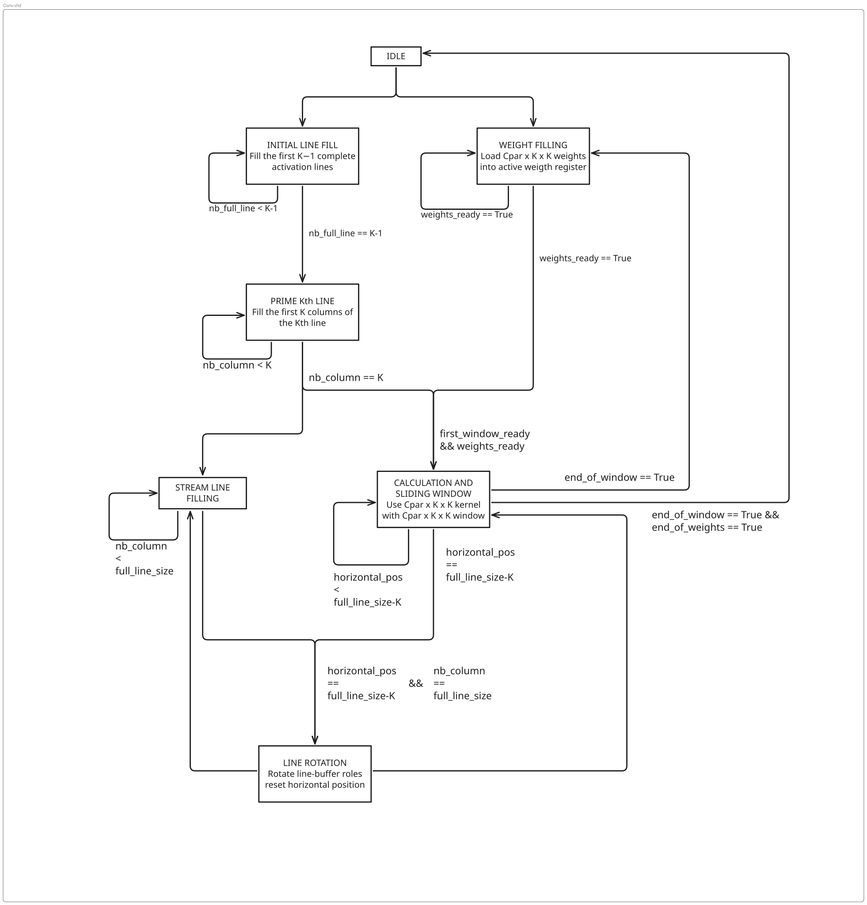

# `conv_layer`

Generic streaming convolution layer for the FPGA inference pipeline.

> **Status:** architectural draft.  
> The controller schedule is defined at a high level, but the external interface,
> exact cycle timing, and datapath details are still being finalized.

---

## Role

`conv_layer` performs one quantized convolution stage:

```text
uint8 activations
    ↓
int8 convolution weights
    ↓
int32 accumulation
    ↓
bias + ReLU + fixed-point requantisation
    ↓
uint8 output activations
```

The same generic layer is intended to support all convolution stages by changing
its dimensions, kernel size, channel counts, padding, and parallelism parameters.

The architecture is designed around continuous streaming:

- incoming activations fill line buffers;
- convolution starts as soon as the first complete window is available;
- the next activation line continues filling while the current rows are processed;
- weights are loaded independently and synchronized with activation readiness;
- physical line-buffer contents are not copied during rotation—only their roles change.

---

## Current design decisions

### Activation buffering

For a `K × K` convolution window, the controller keeps:

- `K` active activation rows used by the convolution;
- one spare row buffer receiving the next activation line.

For `K = 3`, the physical roles are therefore:

```text
three active row buffers
one spare write buffer
```

After one output row is complete, the oldest active buffer is released and becomes
the next spare write buffer.

### Weight handling

The convolution datapath receives weights through a common weight-stream abstraction.

The source may be:

- local FPGA BRAM initialized at configuration time; or
- a FIFO filled from external FPGA SDRAM.

The convolution controller should not depend on which source is selected.

The active working set is currently defined as:

```text
C_PAR × K × K weights
```

where `C_PAR` is the number of input-channel contributions processed in parallel.

### Accumulation

Activations are unsigned 8-bit values, weights are signed 8-bit values, and partial
sums use signed 32-bit accumulators.

Bias is used to initialize the accumulator for an output value. Contributions from
successive input-channel groups are then added until the output is complete.

The exact accumulator-bank organization is still to be finalized because it depends
on the final output-channel and weight-group loop order.

---

## Interface

The external interface is intentionally left undefined for now.

The final entity is expected to include:

- clock and reset;
- ready/valid activation input;
- ready/valid activation output;
- ready/valid weight input;
- frame or tensor boundary information;
- generics for tensor dimensions, kernel size, padding, stride, and parallelism.

Exact signal names, widths, sideband fields, and tensor ordering will be defined only
after the controller schedule and datapath are validated in simulation.

---

## Controller state machine

The current controller is represented as a concurrent statechart. Several states may
remain active as independent operations progress, allowing activation filling, weight
movement, and convolution work to overlap.

<p align="center">
  <a href="State_Machine_conv.svg">
    
  </a>
</p>

<p align="center">
  <em>Click the diagram to open the full-size SVG.</em>
</p>

> The path above assumes:
>
> ```text
> docs/
> ├── diagrams/conv_controller_fsm.svg
> └── modules/conv_layer.md
> ```
>
> Adjust the relative path if this document is stored elsewhere.

---

## State-machine behavior

### `IDLE`

Waits for the start of a new activation tensor.

The transition out of `IDLE` starts two independent preparation paths:

```text
initial activation-line filling
            ||
initial weight filling
```

---

### `INITIAL LINE FILL`

Fills the first `K - 1` complete activation lines.

```text
remain in state while:
    nb_full_line < K - 1

leave state when:
    nb_full_line = K - 1
```

No convolution can begin yet because the `K`th row is not sufficiently available.

---

### `PRIME Kth LINE`

Fills the first `K` columns of the `K`th activation line.

```text
remain in state while:
    nb_column < K

first window ready when:
    nb_column >= K
```

At this point, the first `K × K` activation window exists, even though the `K`th line
has not yet been filled completely.

---

### `WEIGHT FILLING`

Loads one active weight group:

```text
C_PAR × K × K weights
```

The state remains active until the complete group is available, then asserts:

```text
weights_ready
```

Weight filling begins independently from activation-line filling.

---

### Calculation join

The horizontal convolution sweep begins only when both sides are ready:

```text
first_window_ready
AND
weights_ready
```

Using a latched `first_window_ready` condition is safer than testing only
`nb_column = K`, because activation filling may advance beyond column `K` while
waiting for weights.

---

### `CALCULATION AND SLIDING WINDOW`

Uses the active `K × K × C_PAR` activation window and matching weights.

During the horizontal pass:

```text
calculate current window
    ↓
advance the activation window by one column
    ↓
repeat until the horizontal sweep is complete
```

The active weight group remains fixed during one horizontal sweep. The activation
window moves across the row.

At the end of the sweep:

- if more weight groups are required, return to `WEIGHT FILLING` and sweep the same
  active rows again;
- if the final required weight group is complete, wait for the next activation line
  to be ready before rotating the line-buffer roles.

---

### `STREAM LINE FILLING`

Runs concurrently with the horizontal convolution sweep.

It first completes the partially filled `K`th line, then continues writing the next
activation line into the spare row buffer.

```text
finish current line
    ↓
select spare row buffer
    ↓
fill next line
```

The stream-filling path stops when the spare row buffer contains one complete line.

---

### `LINE ROTATION`

Entered when both conditions are satisfied:

```text
all required horizontal sweeps for the current row are complete
AND
the next activation line is completely filled
```

The state changes buffer roles only; it does not copy activation data.

For `K = 3`:

```text
before rotation:
    active rows = A, B, C
    spare row   = D

after rotation:
    active rows = B, C, D
    spare row   = A
```

The horizontal position is reset, and the released oldest row becomes the next write
buffer.

---

### End of tensor

After the final output row and final weight group are complete, the controller drains
any remaining output data and returns to `IDLE`.

The exact final-state and output-handshake behavior will be defined with the external
interface.

---

## Open design points

The following items are intentionally not fixed yet:

- exact VHDL entity and port list;
- activation tensor ordering and transfer width;
- exact definition of `C_PAR`;
- output-channel parallelism;
- accumulator-bank size and addressing;
- padding and stride scheduling;
- local-BRAM versus external-FIFO weight adapters;
- output serialization and backpressure behavior;
- end-of-frame and pipeline-drain handling.

These decisions will be made incrementally while building `conv.vhd` and its
testbenches.

---

## Verification plan

Implementation should proceed in small, independently verified steps:

1. verify filling of the first `K - 1` complete lines;
2. verify priming of the first `K` columns of the `K`th line;
3. verify one `C_PAR × K × K` weight-group load;
4. verify the activation-ready and weight-ready join;
5. verify one horizontal window sweep;
6. verify simultaneous line filling and calculation;
7. verify line-buffer role rotation;
8. verify repeated weight-group sweeps and accumulation;
9. verify a complete small convolution against a software reference;
10. add padding, requantisation, output streaming, and backpressure.

The first testbenches should use very small tensors so every line-buffer write,
weight load, window position, and accumulator value can be inspected directly.